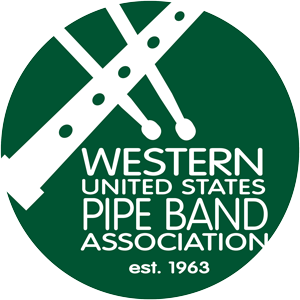
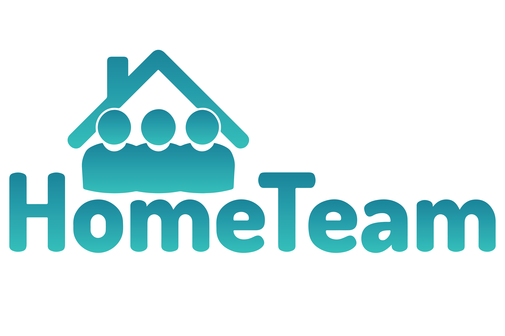

## About the Project
[www.registration.WUSPBA.org](http://register.wuspba.org/)  
WUSPBA Event Management website meets the needs of WUSPBA in order to manage and organize large scale events. 

## Who is WUSPBA? 

 

The Western United States Pipe Band Association is an association of pipe bands from the Western United States.
It sanctions band and solo piping competitions and has a membership of over fifty bands.

## Who is Hometeam?

 

We are a group of Computer Science students attending the University of Utah working towards our Senior Capstone project.
We chose this project because we wanted to help a non-profit organization, and for the learning exerience in implementing
a large project. 

---

>   
> Kevin Nguyen    
> Full stack Developer, AWS Cognito and EC2

>   
> Todd Thornley    
> Full stack Developer and Database Backend

>   
> Warren Kidman    
> Full stack Developer and E-Commerce

>   
> William Meldrum    
> Full stack Developer

>   
> Johnny Zhang    
> Mobile Application and AWS Cognito

